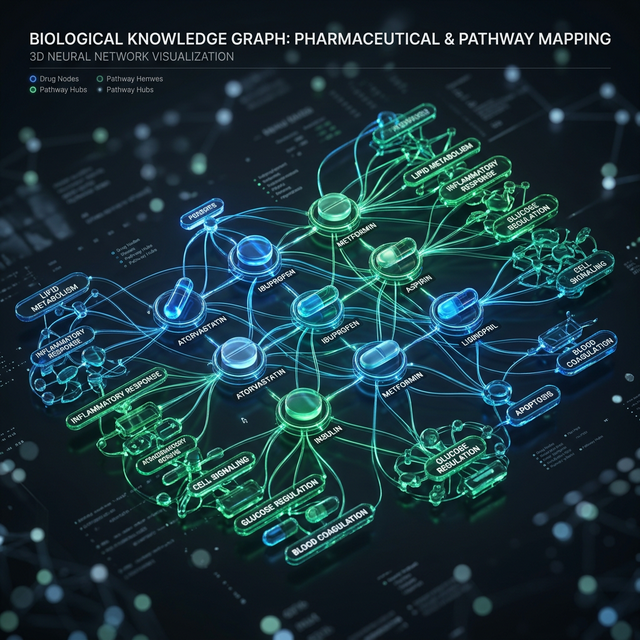
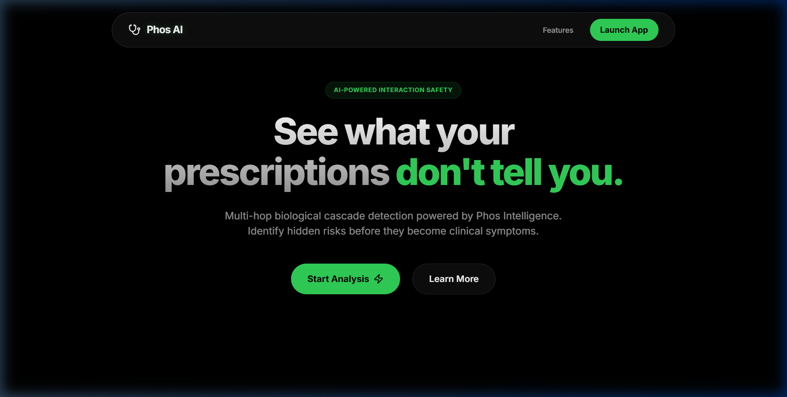
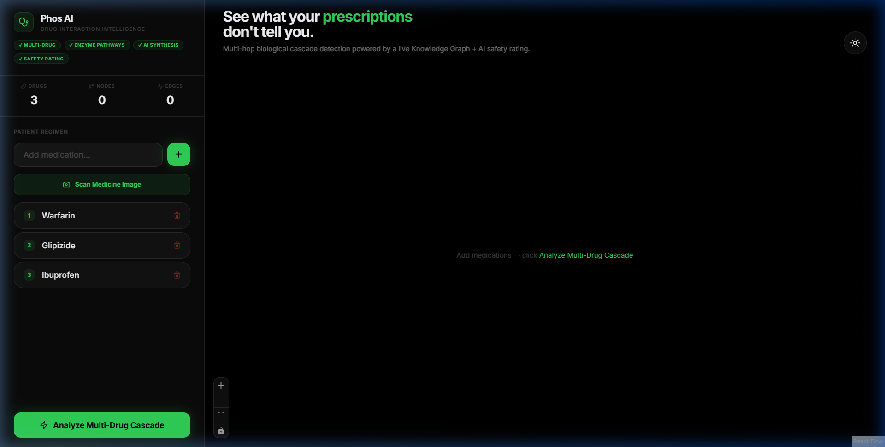
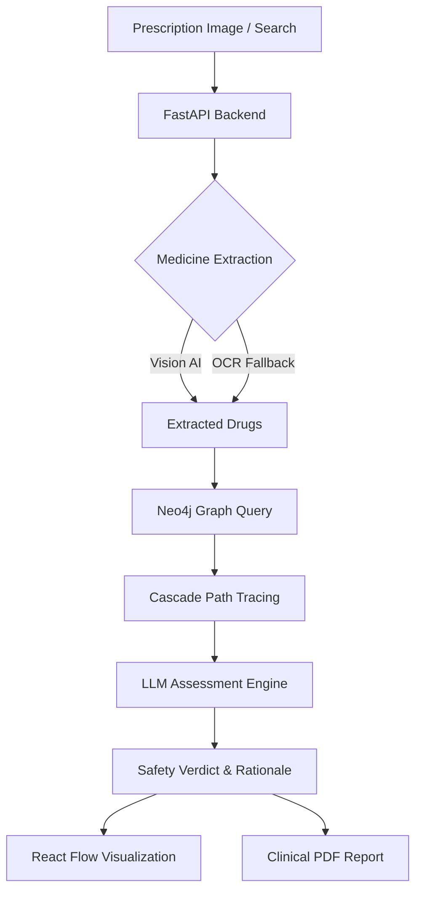

# Phos AI: Illuminating Drug Interaction Cascades
**Bridging the gap between labels and complex biological outcomes.**

## 1. The Core Problem
Most clinical systems check for drug interactions using **isolated pairwise checks** (Drug A vs Drug B). However, polypharmacy patients—those with complex conditions like heart disease or diabetes—often take five or more medications simultaneously.

Traditional tools miss **cascading interactions**, where:
1. **Drug A** inhibits an enzyme (e.g., CYP3A4).
2. That enzyme is responsible for metabolizing **Drug B**.
3. The resulting accumulation of **Drug B** dangerously interacts with **Drug C**.

These blind spots lead to thousands of preventable adverse events every year.

## 2. Our Solution: The Holistic Graph Approach
**Phos AI** (named after the Greek word for 'Light') illuminates these hidden pathways by mapping the patient's entire biology as an interconnected graph. 

### Key Features:
- **🧬 Cascade Detection**: Traces secondary and tertiary risks through enzymes, biological transporters, and symptoms.
- **🧠 AI Safety Verdicts**: Synthesizes complex graph data into 3-tier clinical safety verdicts (SAFE, CAUTION, DANGER) using state-of-the-art LLMs.
- **📸 Medicine Extraction**: Built-in Vision AI (Qwen-VL) and OCR fallbacks to extract drug names directly from prescription labels or medication bottles.
- **📄 Clinical Reports**: Generates professional, PDF-ready clinical reports and specialist referrals with a single click.
- **🔄 Smart Swaps**: AI-driven suggestions to resolve conflicts by suggesting safer alternatives.

## 3. UI Showcase

### Landing Page
The entry point for Phos AI, designed with a premium, clinical dark-mode aesthetic.

### Application Dashboard
The core workspace where clinicians manage patient regimens and analyze biological cascades.

## 4. Technology Stack

### Backend
- **FastAPI**: High-performance Python API framework.
- **Neo4j**: Graph database used to map pharmacological ontologies and biological pathways.
- **OpenAI / Featherless AI**: 
    - `Qwen/Qwen2.5-72B-Instruct` for logic and synthesis.
    - `Qwen/Qwen3-VL-30B-A3B-Instruct` for vision-based medicine extraction.
- **Pytesseract**: Fallback OCR engine.

### Frontend
- **React 19 & Vite**: Modern, responsive frontend architecture.
- **React Flow (@xyflow/react)**: Interactive visualization of biological interaction networks.
- **Tailwind CSS**: Premium, dark-mode clinical UI.
- **Lucide React**: Vector icons for clinical precision.

## 5. Architecture

## 6. Getting Started

### Prerequisites
- Python 3.9+
- Node.js 18+
- Neo4j Database (Local or Aura)

### Backend Setup
1. Navigate to `/backend`.
2. Install dependencies: `pip install -r requirements.txt`.
3. Configure your `.env` file with Neo4j and Featherless AI credentials.
4. Run the server: `uvicorn main:app --reload`.

### Frontend Setup
1. Navigate to `/frontend_v2`.
2. Install dependencies: `npm install`.
3. Run the development server: `npm run dev`.
4. Open `http://localhost:5173` in your browser.

---
**Phos AI** | Bringing clarity and light to complex pharmacology.
